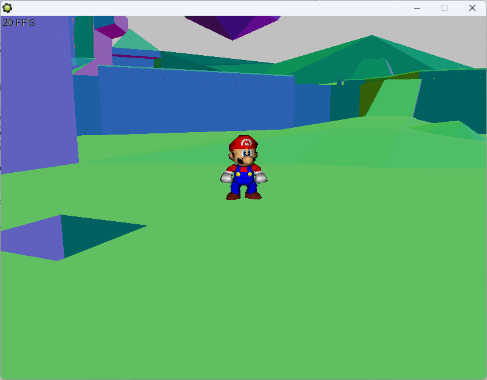

# libsm64-gm8 - Game Maker 8 bindings for libsm64

An extension for Game Maker 8 that integrates [libsm64](https://github.com/libsm64/libsm64). 
If you want to mod games with this, you'll need Game Maker 8 Pro.

You can find example projects in the "examples" directory.

## Building the DLL
- [Follow steps 1-4 for setting up MSYS2 MinGW 64 here](https://github.com/sm64-port/sm64-port#windows), but replace the repository URL with `https://github.com/headshot2017/libsm64-gm8.git`
- Make sure you're compiling with MSYS2 MinGW x86, and not MSYS2 MinGW x64
- Ensure these dependencies are installed:
  - 32 bits: `pacman -S mingw-w64-i686-SDL2 mingw-w64-i686-libpng`
- Run `make` to build
- To run the test program in the 'gmk' folder, you'll need a SM64 US ROM in the gmk folder with the name `sm64.us.z64`.
